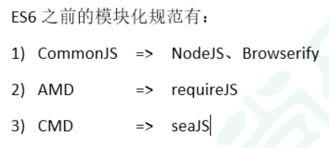
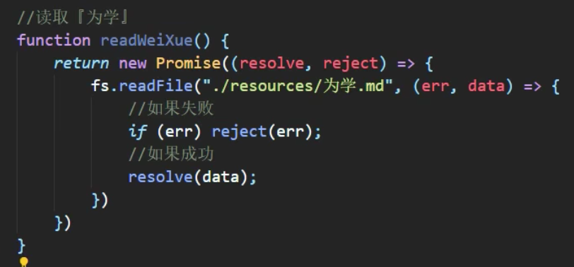
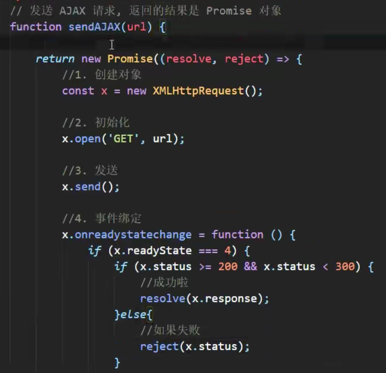
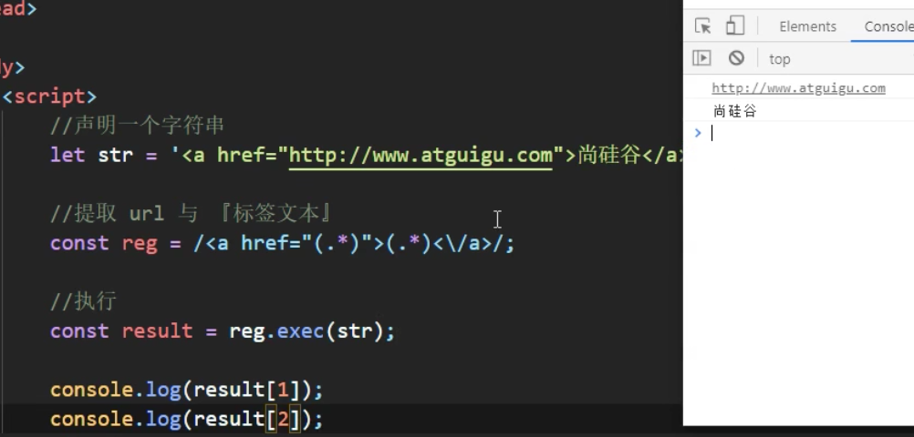

# class 继承

1. class 里面可以没有构造函数
2. 子类重写父类的函数，不能调用 super()
3. `class xxx { get yy(){},set(newVal){}}`

# 数值扩展

1. Number.EPSILON JavaScript 的最小精度
   - 1+2 === 3 false
   - Math.abs((1+2)-3) < Number.EPSILON true
   1. 清楚 false 的底层原理！
2. 2、8、10、16 进制
3. Number.isFinite
4. Number.isNAN()
5. Number.parseInt() Number.parseFloat()
   - 存在截取
6. Math.trunc()
   - 去除小数部分
7. Math.sign()
   - 正数：1，0：0，负数：-1

# 对象方法扩展

1. Object.is()
   - 判断两个对象是否全等
   - 特别的：Object.is(NaN,Nan) true 但是 NaN 和任何用===比较，都是 false
2. Object.asign()
   - 对象合并
   - 第一个参数是 target
   - 后面参数有的属性会将前面的覆盖
3. Object.setPrototypeOf()
   - 设置原型对象，将第一个参数的原型设置为第二个参数
   - 不建议使用，建议 Object.create()的时候设置
4. Object.getPrototypeOf()

# 模块化

1. 优点
   1. 防止命名冲突
   2. 代码复用，暴露接口实现
   3. 高维护性，可以只对部分升级
2. ES6 之前模块化产品
   - 
3. ES6 模块化——分别暴露
   1. 一个个 export
   2. scirpt 标签，设置 type 属性为"module"
   3. 引入，`import xx as yy from './zz.js'`
   4. 直接 yy.
   5. 分别暴露可以用解构赋值的形式，直接用，还可以取别名，`import {school as sc, city} from ''`
4. 统一暴露
   - export {xx,yy}
   - 后面同上
5. 默认暴露
   1. export default 可以是字符串、对象等
   2. 需要 yy.defalt.
   3. 用解构赋值，不能直接用 default，`import {default as xx} from ''`
   4. 简写形式：直接 `import 别名 from ''`，不需要 import \* as

# 入口文件

1. 在入口文件统一引入
2. 之后在 html 文件中，通过 script 标签，src 属性设置入口文件路径，type 属性设置 module
3. script 标签写在 body 最后，和写在 head 标签里面的区别？

# ES6->ES5

1. 安装：babel 命令行工具、babel 预设包（ES6->ES5 commonjs）、打包工具 browserify 或 webpack
   1. npm babel-cli babel-preset-env browsify -D
   2. -D 开发依赖
2. 局部安装 npx babel，全局安装就 babel
   1. npm babel src/js -d dist/js --presets=babel-preset-env
   2. 两个路径分别是原路径和生成路径
3. 生成的 ES5 是 commonjs 语法，浏览器无法直接识别，还需要处理
   1. npx browserify dist/js/app.js -o dist/bundle.js
   2. 无论浏览器是否支持 ES6 都能执行了

# ES6 模块化+npm 包使用

1. ES6 导入 jquery`import $ from 'jquery'`
2. ES5 导入 jquery`const $ = require('jquery')`
3. $('body').css('background','pink')
4. 总之，先按照 ES6 引入，后打包、处理，在 thml 中引入 dist 的 js

# ES7 新特性

1. `Arr.prototype.includes()`
   1. arr.includes(数组元素)-true or false
   2. indexof 能用，但不好用
2. 指数运算符，幂运算\*\*
   - \*\*和 Math.pow(a,b)

# ES8

1. async 和 await
   - 让异步代码像同步代码一样
2. 异步解决方案有哪些
   1. 生成器函数
   2. Promise
   3. async 和 await
3. async 函数
   1. 返回值是一个 Promise 对象
   2. 只要 async 函数（我们写的）返回的不是一个 promise 对象，返回的都是成功的 promise 对象（resolved）
   3. 如果 throw new error 会返回一个失败的 promise 对象（rejectd）
   4. 如果返回的是一个 promise 对象，只要 return 的这个 promise 成功（也就是调用了 resolve），函数返回的就是成功，而且值也是这个
4. await 表达式
   1. 写在 async 函数中
   2. await 右侧表达式是 promise 对象
      1. async 里面是 resolve，则 await 返回结果是传进 resolve 的值
      2. async 里面是 reject，则需要在 async 里面通过 try-catch 进行捕获，try 里面才能获得传进 reject 的值
5. async、await 结合读取文件
   1. nodejs 的 fs 模块来读取文件，`comst fs = require('fs')`
   2. 先写几个获取文件的函数，返回 promise 对象
   3. 再声明 async 函数，通过 await 获取各个函数获取文件成功的值
   4. node 文件名 来执行 js 文件
6. await、await 结合封装 ajax 请求，返回 promise 对象
   1. new XMLHttpRequest()、open、send、onreadstatechange
   2. 将上述统一作为 return new promise 的回调函数
   3. 总之用 async 和 await 来接收结果
7. 一定要动手试一下

# ES8 对象方法扩展

1. Object.keys()
   - 返回数组，数组元素是键
2. Object.values()
   - 返回数组，数组元素是值
3. Object.entries()
   1. 返回数组，数组元素是数组（两个元素，分别是键值）
   2. 用于生成 Map，`cosnt m = new Map(Object.entries(obj))`
   3. map 实例通过.get()获取
4. Object.getOwnPropertyDescriptors()
   1. 返回对象属性的描述对象
   2. 意思是：返回一个对象，属性还是这些属性，属性值变成了对象，用 value、writable、enumerable、configurable 来描述这个属性
   3. 是创建对象时属性的描述对象
      - 创建对象时 Object.create(原型对象，创建对象)
      - 创建对象为：`{property:描述对象}`

# ES9

1. 对象展开
   - Rest 参数和 spread 扩展运算符在 ES6 中引入的，但是只针对数组，ES9 中提供给对象
2. 正则表达式也掌握的不好。。。
3. 正则扩展-命名捕获分组
   1. 原本可以通过`(.*)`来捕获 url 和标签文本
   2. 通过`(?<url>.*)`和`(?<text>.*)`实现命名捕获分组，会形成一个 groups，分别是 url 和 text 两项数组元素
   3. `通过reg.exec(str)`来执行
4. 正则扩展-反向断言
   1. 正向断言通过匹配后面的来确定前面的
   2. 反向断言通过匹配前面的来确定后面的
   3. =和<=是什么
5. 正则扩展-dotAll模式
    1. dot是.，元字符，除了换行符以外的任意单字符
    2. 原本的方法，为什么要加?来着？禁止贪婪？要疯狂加\s，正则表达式里面要写/必须写成\/的形式进行转义，
    3. 
